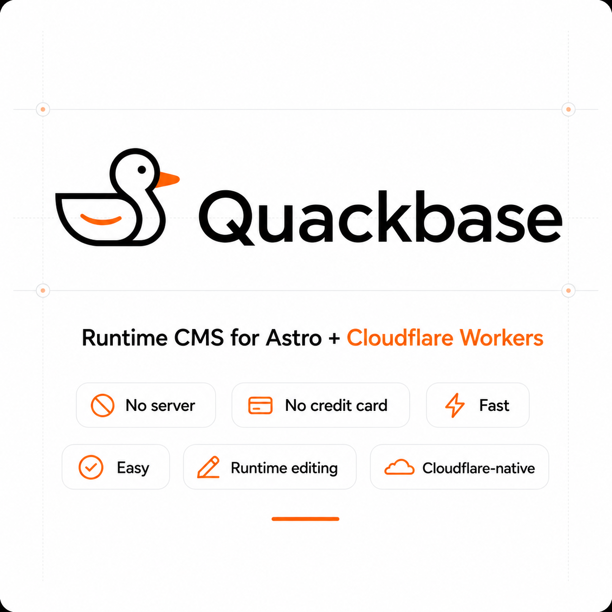

<p>
  <a href="./README.md"></a>
  <a href="./README.vi.md"></a>
</p>

<h1 style="display: flex; align-items: center; gap: 10px;">
  
  <span>Quackbase</span>
</h1>

[](https://www.typescriptlang.org/)
[](https://astro.build/)
[](https://workers.cloudflare.com/)
[](https://developers.cloudflare.com/d1/)
[](https://opensource.org/licenses/MIT)

[](https://deploy.workers.cloudflare.com/?url=https://github.com/xuanlockun/astro-blog-starter-template)



**Quackbase is a runtime CMS for Astro, powered by Cloudflare Workers and D1.**

Build fast content-driven websites without spinning up a server, wiring a traditional backend, or paying for a database before your project even has users.

Quackbase gives you a clean admin experience, runtime content editing, and a deploy-anywhere-on-Cloudflare setup that feels small, sharp, and ridiculously easy to ship.

## Why Quackbase?

Most CMS setups are either too heavy, too expensive, or too annoying to deploy.

Quackbase is built around a simpler idea:

> Your Astro site should stay fast, your content should be editable at runtime, and your infrastructure should fit in your pocket.

No credit card.  
No server.  
No vendor ceremony.  
No bullshit.

Just Astro, Cloudflare Workers, D1, and a tiny CMS layer that gets out of your way.

## What you get

- **Runtime content editing**  
  Update pages, posts, and structured content without rebuilding the whole site every time.

- **Cloudflare-native deployment**  
  Runs on Cloudflare Workers with D1 as the database layer.

- **Astro-first architecture**  
  Designed for Astro projects, not retrofitted from a generic CMS.

- **Clean admin UI**  
  A simple editing experience for managing content without touching code.

- **Fast by default**  
  Built close to the edge, with a lightweight stack and minimal moving parts.

- **Open source and hackable**  
  TypeScript all the way down. Fork it, customize it, break it, make it yours.

## Built for

Quackbase is a good fit for:

- blogs
- docs sites
- landing pages
- changelogs
- portfolios
- startup websites
- small content-heavy products
- indie projects that need a CMS without the baggage

## Not built for

Quackbase is intentionally small.

It is probably not what you want if you need:

- enterprise workflow approval chains
- massive editorial teams
- complex multi-tenant permission systems
- a WordPress replacement with every plugin under the sun

This project is for people who want something lean, understandable, and easy to deploy.

## Tech stack

- **Astro 5**
- **TypeScript**
- **Cloudflare Workers**
- **Cloudflare D1**
- **Wrangler**

## Installation

[](https://deploy.workers.cloudflare.com/?url=https://github.com/xuanlockun/astro-blog-starter-template)

Deploy and setup admin credential at /admin

## 🚀 Features

### Core Platform
- **⚡ Edge-First**: Built for Cloudflare Workers with global performance
- **🔧 Developer-Centric**: TypeScript-first and admin-friendly
- **🤖 AI-Friendly**: Structured codebase that is easy to extend
- **📱 Modern Stack**: Astro 5, Cloudflare D1, R2, Bootstrap 5
- **🚀 Fast & Lightweight**: Designed for runtime content, not heavy rebuilds

### Content Management
- **📝 Posts and Pages**: Create and edit runtime content
- **🎛️ Site Settings**: Manage title, logo, favicon, and media config
- **📚 Draft / Publish Flow**: Content can be controlled before going live
- **🌍 Localized Content**: Multilingual content and localized slugs
- **🧩 Modular Admin**: Settings, media, pages, roles, users, and languages

### Media Management
- **🖼️ Media Library**: Upload and manage assets from the admin panel
- **☁️ R2 / S3-Compatible**: Works with Cloudflare R2 or S3-compatible buckets
- **🔐 DB-Backed Settings**: Media config is stored in the database
- **👁️ Secret Toggle**: Reveal saved access key fields when needed
- **🧪 Test Connection**: Validate media credentials from settings

## 📊 What It Includes

| Area | Edge CMS |
|--|--|
| **Runtime content** | Yes |
| **Cloudflare Workers** | Yes |
| **Cloudflare D1** | Yes |
| **Media uploads** | Yes |
| **RBAC** | Yes |
| **Multilingual UI** | Yes |
| **Localized content** | Yes |
| **Database-backed settings** | Yes |


## For application developers

## Database And Migrations

The repository now splits migrations into two folders:

- `migrations/` - real bootstrap migrations for new installs
- `migrations-dev/` - the old SQL history and local test migrations

Wrangler points at `migrations/` by default, so fresh installs apply the bootstrap file first.


## 📁 Project Structure

```text
.
|-- locales/
|-- migrations/
|-- migrations-dev/
|-- public/
|-- src/
|   |-- components/
|   |-- layouts/
|   |-- lib/
|   `-- pages/
|-- tests/
`-- wrangler.json
```

## 📚 Documentation

- [Astro](https://astro.build/)
- [Cloudflare Workers](https://developers.cloudflare.com/workers/)
- [Cloudflare D1](https://developers.cloudflare.com/d1/)
- [Cloudflare R2](https://developers.cloudflare.com/r2/)

## 📄 License

MIT License - see [LICENSE](LICENSE) file for details.

## Credit

From V1t with love ❤️

Thanks to [Mr. Hieu](https://www.linkedin.com/in/hieu-ha-ngoc) for inspiring this project.

 X 
