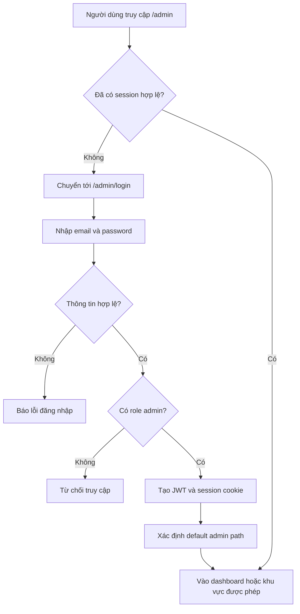
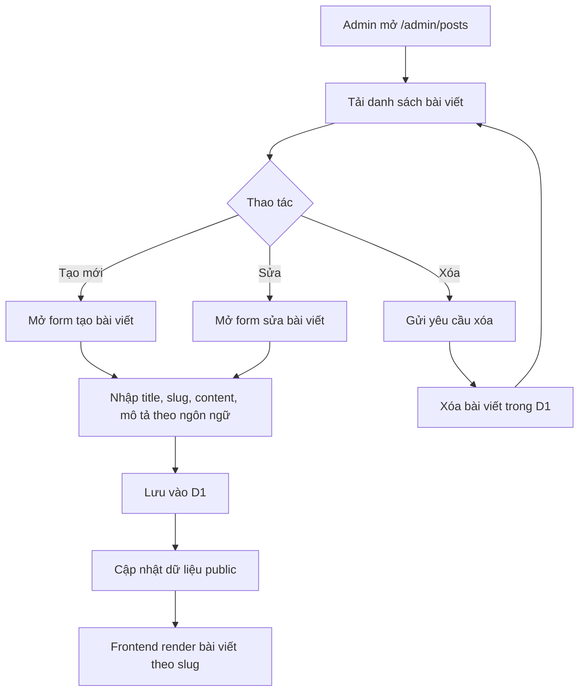
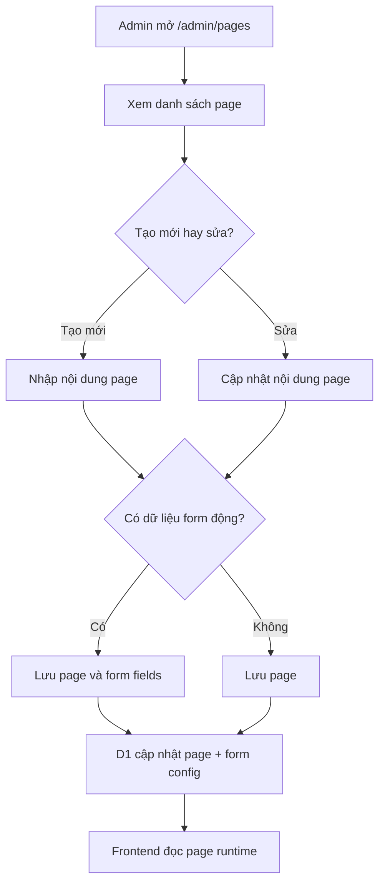
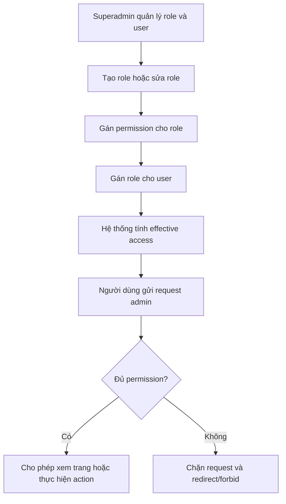
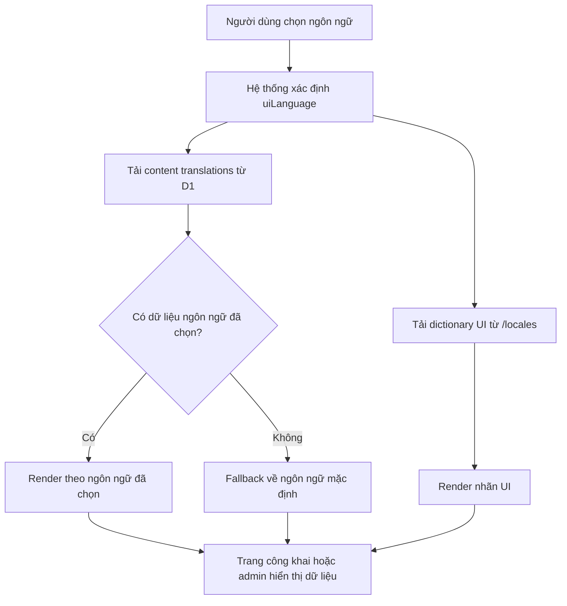
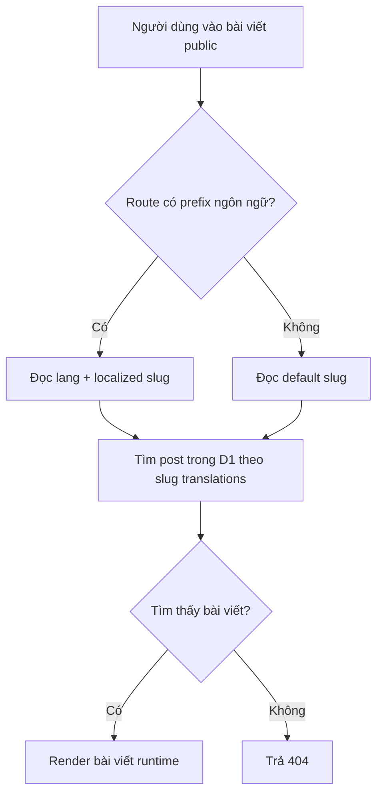
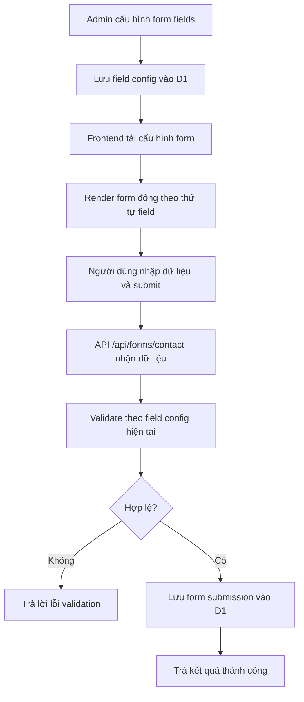

# Edge CMS

[](https://deploy.workers.cloudflare.com/?url=https://github.com/lane711/sonicjs-deploy-now)

Edge CMS là dự án CMS runtime được xây dựng trên Astro + Cloudflare D1, tận dụng Edge Network của Cloudflare để thực thi và phân phối nội dung. Dự án được mở rộng từ Astro blog starter thành hệ thống quản trị nội dung hoàn chỉnh với admin, phân quyền, đa ngôn ngữ và khả năng mở rộng theo feature.

Em hiện có quy trình như sau :>
1. Yêu cầu thô của khách hàng
2. Rewrite thành yêu cầu rõ ràng
3. Từ yêu cầu đó viết ra quy trình nghiệp vụ
4. Xác định Yêu cầu phi chức năng
5. Phân rã thành các feature/spec các đặc tả khác nhau
6. Tiến hành biến các đặc tả spec thành plan 
7. Chia các plan thành các task nhỏ
8. AI code theo các task đó
9. AI viết test case
10. Kiểm tra và xác nhận manual 
11. Triển khai demo Dev/Staging

## 1. Yêu Cầu Thô Của Khách Hàng

Có thể tóm tắt yêu cầu thô của bài toán này như sau:

- Cần một CMS để quản lý nội dung
- Có thể đăng blog, post, page
- Có thể tùy biến một số nội dung và style giao diện
- Có admin login
- Có authentication và RBAC
- Có đa ngôn ngữ cho nội dung và giao diện
- Có URL đa ngôn ngữ hoặc localized URL
- Có thể mở rộng thêm các tính năng như form động, cấu hình site, và các module khác về sau

## 2. Rewrite Thành Yêu Cầu Rõ Ràng

### 2.1 Mục tiêu sản phẩm

Xây dựng một CMS runtime cho phép quản trị nội dung website trực tiếp trên hệ thống mà không phụ thuộc vào việc rebuild nội dung Markdown tĩnh mỗi khi cập nhật.

### 2.2 Người dùng chính

- Quản trị viên hệ thống
- Biên tập viên nội dung
- Người truy cập frontend

### 2.3 Khả năng chính cần có

- Admin đăng nhập để vào khu vực quản trị
- Phân quyền theo role và permission
- Quản lý bài viết, trang tĩnh, người dùng, role, permission
- Quản lý nội dung đa ngôn ngữ
- Hỗ trợ giao diện đa ngôn ngữ
- Hỗ trợ đường dẫn localized cho bài viết công khai
- Hỗ trợ cấu hình một số thành phần frontend động, ví dụ form liên hệ
- Dữ liệu được lưu trong Cloudflare D1 và render runtime

### 2.4 Phạm vi hợp lý ở giai đoạn hiện tại

- Tập trung vào `/admin` và các chức năng CMS core
- Không mở rộng thành CRM hoặc marketing platform đầy đủ
- Form hiện tại chủ yếu theo hướng dynamic contact form
- Style frontend có thể cải tiến dần theo từng feature, không cần giải quyết toàn bộ visual system trong một lần

## 3. Quy Trình Nghiệp Vụ

### 3.1 Quy trình đăng nhập và vào admin

Mô tả:

- Người dùng vào `/admin`
- Nếu chưa đăng nhập thì bị chuyển tới `/admin/login`
- Hệ thống kiểm tra email, password, role admin và permission
- Nếu hợp lệ thì tạo session cookie và điều hướng tới khu vực admin phù hợp



### 3.2 Quy trình quản lý bài viết

Mô tả:

- Editor hoặc admin vào danh sách bài viết
- Tạo mới, sửa, xóa bài viết nếu có permission phù hợp
- Bài viết được lưu trong D1
- Frontend đọc bài viết runtime theo slug đa ngôn ngữ



### 3.3 Quy trình quản lý page và cấu hình nội dung site

Mô tả:

- Admin quản lý page trong `/admin/pages`
- Tạo và sửa page
- Một số page có thể kèm theo dữ liệu cấu hình frontend, ví dụ contact form fields
- Site config có thể được cập nhật tại khu vực header/site settings



### 3.4 Quy trình RBAC

Mô tả:

- Superadmin quản lý role, permission, user assignments
- Mỗi request admin được check permission ở route-level và action-level
- Người dùng chỉ thấy và chỉ thao tác được trên phần được cấp quyền



### 3.5 Quy trình đa ngôn ngữ

Mô tả:

- UI có ngôn ngữ hiển thị
- Bài viết, page, slug và một số field có bản dịch theo ngôn ngữ
- Khi thiếu bản dịch thì fallback về ngôn ngữ mặc định



### 3.6 Quy trình localized URL cho bài viết

Mô tả:

- Mỗi bài viết có thể có slug theo từng ngôn ngữ
- Frontend route public đọc slug và tìm bài viết tương ứng
- URL ngôn ngữ giúp SEO và trải nghiệm ngôn ngữ tốt hơn



### 3.7 Quy trình dynamic contact form

Mô tả:

- Admin cấu hình field cho form liên hệ
- Mỗi field có type và label đa ngôn ngữ
- Frontend render form động theo config
- Người dùng submit, hệ thống validate theo field hiện tại và lưu submission



## 4. Yêu Cầu Phi Chức Năng

### 4.1 Bảo mật

- Toàn bộ route admin cần được bảo vệ bởi authentication
- Action nhạy cảm phải được kiểm tra permission
- Session admin cần được ký bằng JWT và lưu trong cookie
- Hệ thống cần ghi nhật ký các sự kiện bảo mật quan trọng như login, logout, access denied, role changes

### 4.2 Khả năng mở rộng

- Kiến trúc cần cho phép thêm feature mới theo từng spec riêng
- Có thể thêm role, permission, field type, route admin và module mới mà không cần viết lại toàn bộ hệ thống

### 4.3 Tính nhất quán

- UI admin và frontend phải có xu hướng đồng bộ về ngôn ngữ, style và hành vi
- Các flow CRUD nên theo một pattern giống nhau để dễ bảo trì

### 4.4 Khả dụng

- Giao diện phải dùng được trên desktop và mobile
- Form và các trang quản trị cần dễ hiểu, dễ thao tác
- Fallback ngôn ngữ cần rõ ràng, tránh blank content

### 4.5 Vận hành

- Hệ thống phải tương thích với Astro 5, Cloudflare Workers, Cloudflare D1 và Node.js 22 compatibility
- Nội dung được render runtime từ D1, không phụ thuộc vào static build mỗi khi sửa nội dung

## 5. Cách Tách Thành Feature/Spec

Workflow đầy đủ của dự án này nên được hiểu như sau:

1. Yêu cầu thô của khách hàng
2. Rewrite thành yêu cầu rõ ràng
3. Làm rõ quy trình nghiệp vụ
4. Bổ sung yêu cầu phi chức năng
5. Tách thành feature-sized specs
6. Chạy từng feature qua Speckit: `specify -> plan -> tasks -> implement`

Những spec đã có trong repo hiện tại:

- `001-admin-auth-rbac`
- `002-admin-ui-refactor`
- `003-dense-admin-ui`
- `004-admin-crud-layout`
- `005-content-i18n`
- `006-ui-text-i18n`
- `007-localized-post-urls`
- `008-dynamic-form-ui`

Có thể xem đây là lịch sử phát triển theo feature của sản phẩm CMS này.

## 6. Tóm Tắt Kỹ Thuật Hiện Tại

### 6.1 Công nghệ

- Astro 5
- TypeScript 5.9
- Cloudflare Workers runtime
- Cloudflare D1
- Bootstrap 5
- `jose` cho JWT
- `bcryptjs` cho password hashing
- `micromark` cho Markdown rendering

### 6.2 Nguồn sự thật của dữ liệu

- Bài viết, page, cấu hình form và một số cấu hình site được lưu trong D1
- Dictionary UI đa ngôn ngữ được lưu trong Cloudflare D1 `translation_entries`. Dùng `scripts/import-localizations.ts` hoặc `docs/localization.md` để chạy migration và cập nhật copy mà không cần redeploy.
- `src/content/blog/` không còn là nguồn nội dung live chính

## 7. Cài Đặt Dự Án

### 7.1 Cài dependency

```bash
npm install
```

### 7.2 Tạo D1 database

```bash
npx wrangler d1 create edge-cms
```

Sau đó gán `database_id` vào `wrangler.json` với binding tên `DB`.

Ví dụ:

```json
{
  "d1_databases": [
    {
      "binding": "DB",
      "database_name": "edge-cms",
      "database_id": "REPLACE_ME"
    }
  ]
}
```

### 7.3 Chạy migration

Kiểm tra thư mục `migrations/` và apply theo thứ tự migration của dự án. Nếu đang khởi tạo mới, cần đảm bảo schema trong D1 đã được apply trước khi chạy CRUD.

Ví dụ cách chạy:

```bash
npx wrangler d1 execute edge-cms --local --file=./migrations/0001_create_posts.sql
npx wrangler d1 execute edge-cms --remote --file=./migrations/0001_create_posts.sql
```

Nếu có thêm migration mới, chạy tiếp từng file theo thứ tự.

### 7.4 Cấu hình secret cho admin

Hệ thống cần secret cho JWT và các biến liên quan đến admin/auth trong môi trường runtime.

Trong local, bạn có thể set env theo cách phù hợp với shell của mình. Trong Cloudflare, sử dụng Wrangler secret cho các biến nhạy cảm.

### 7.5 Chạy local

```bash
npm run dev
```

### 7.6 Lệnh hay dùng

| Lệnh | Mục đích |
| :-- | :-- |
| `npm run dev` | Chạy local Astro |
| `npm run build` | Build project |
| `npm run check` | Build + type-check + dry-run deploy |
| `npm test` | Chạy test |
| `npm run preview` | Preview với Wrangler |
| `npm run deploy` | Deploy lên Cloudflare |

## 8. Cấu Trúc Project

```text
.
|-- locales/
|-- migrations/
|-- public/
|-- specs/
|-- src/
|   |-- components/
|   |-- layouts/
|   |-- lib/
|   |   |-- auth/
|   |   |-- db/
|   |   |-- rbac/
|   |   |-- blog.ts
|   |   |-- forms.ts
|   |   `-- i18n.ts
|   |-- pages/
|   |   |-- admin/
|   |   |-- api/
|   |   |-- blog/
|   |   `-- [lang]/
|   `-- styles/
|-- tests/
|-- README.md
`-- wrangler.json
```

### 8.1 Một số file/thư mục quan trọng

- `src/lib/blog.ts`: helper chính cho bài viết, page, site config và D1-backed content logic
- `src/lib/forms.ts`: dynamic form fields và form submissions
- `src/lib/i18n.ts`: helper ngôn ngữ, localized path và dictionary handling
- `src/lib/auth/`: cookie, JWT, password, audit
- `src/lib/rbac/`: guard, policy và permission checks
- `src/middleware.ts`: middleware mức ứng dụng
- `specs/`: tài liệu feature theo workflow Speckit

## 9. Route Chính

### 9.1 Public routes

- `/`
- `/[slug]`
- `/blog/[...slug]`
- `/[lang]/[slug]`
- `/[lang]/blog/[...slug]`

### 9.2 Admin routes

- `/admin`
- `/admin/login`
- `/admin/header`
- `/admin/posts`
- `/admin/posts/new`
- `/admin/posts/[id]/edit`
- `/admin/pages`
- `/admin/pages/new`
- `/admin/pages/[id]/edit`
- `/admin/users`
- `/admin/users/new`
- `/admin/users/[id]/edit`
- `/admin/roles`
- `/admin/roles/new`
- `/admin/roles/[id]/edit`
- `/admin/permissions`

## 10. API Endpoints

Bảng dưới đây tóm tắt các endpoint đang có trong source hiện tại.

| Endpoint | Method | Mục đích |
| :-- | :-- | :-- |
| `/api/admin/auth/login` | `POST` | Đăng nhập admin, tạo session cookie/JWT |
| `/api/admin/auth/logout` | `POST` | Đăng xuất admin, xóa session cookie |
| `/api/admin/posts` | `GET` | Lấy danh sách bài viết admin |
| `/api/admin/posts` | `POST` | Tạo bài viết mới hoặc lưu bài viết từ form/json |
| `/api/admin/posts/[id]` | `GET` | Lấy chi tiết bài viết |
| `/api/admin/posts/[id]` | `POST` | Cập nhật bài viết theo id |
| `/api/admin/posts/delete` | `POST` | Xóa bài viết |
| `/api/admin/pages` | `POST` | Tạo mới hoặc cập nhật page, có thể kèm dynamic form fields |
| `/api/admin/pages/delete` | `POST` | Xóa page |
| `/api/admin/site` | `POST` | Lưu site/header config |
| `/api/admin/form-fields` | `GET` | Lấy cấu hình field của dynamic form |
| `/api/admin/form-fields` | `POST` | Lưu cấu hình field của dynamic form |
| `/api/admin/roles` | `GET` | Lấy danh sách role và permission |
| `/api/admin/roles` | `POST` | Tạo role |
| `/api/admin/roles/[roleId]` | `PATCH` | Cập nhật role |
| `/api/admin/roles/[roleId]` | `DELETE` | Xóa role |
| `/api/admin/roles/[roleId]` | `POST` | Fallback form submit cho sửa/xóa role |
| `/api/admin/users` | `GET` | Lấy danh sách user admin và role summaries |
| `/api/admin/users` | `POST` | Tạo user admin |
| `/api/admin/users/[userId]` | `PATCH` | Cập nhật user admin |
| `/api/admin/users/[userId]` | `POST` | Fallback form submit cho sửa user |
| `/api/admin/permissions` | `GET` | Lấy danh sách permission |
| `/api/forms/contact` | `POST` | Submit contact form động từ frontend |

### 10.1 Ghi chú về bảo vệ endpoint

- Các endpoint admin được bảo vệ bởi `requireApiPermission(...)`
- Một số endpoint cho phép vừa form submit vừa JSON request
- Redirect hoặc JSON error tùy theo content type và context request
